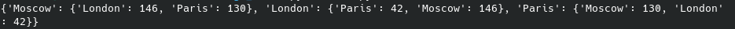
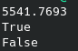
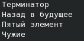
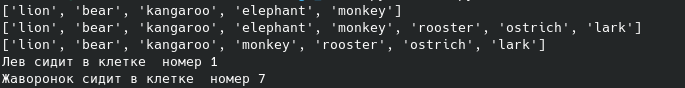
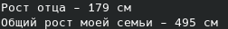
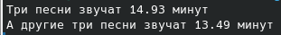
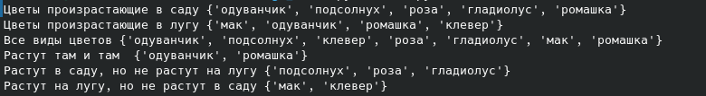
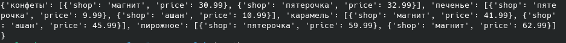
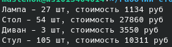

# Лабораторная работа номер 1

## Задание

Выполнить 11 заданий которые содержаться в архиве на [сайте](https://evil-teacher.on.fleek.co/python/lab01/)

## список заданий и способы решения
### к заданиям прилагается скриншот результата
0. задание "города" требует посчитать расстояние между городов чьи координаты указаны в массиве:

1. посчитать радиус и площадь круга и проверить утверждения

2. необходимо при помощи порядка цифр 1,2,3,4,5 и любых вычислений между ними получить число 25.

3. необходимо расположить "любимые фильмы" в требуемом заданием порядке:

4. посчитать общий рост семьи. При том что рост каждого члена семьи мы указываем выше в массиве около их положения в семье.

5. необходимо изменять по порядку задания массив зверей в зоопарке.

6. требуется посчитать время игры определённых песен.

7. расшифровать "тайное сообщение" по ключу которое дано в задании.

8. используя определённые знаки правильно выводить текст используя 2 списка.

10. прямо в коде создать список определяющий самые дешёвые места для закупки товаров.

11. самое большое из заданий требует посчитать цены на товары в магазинах не используя циклы.

## Список использованных источников:

1. [синтаксис питона](https://cs.mipt.ru/algo/lessons/lab2.html)
