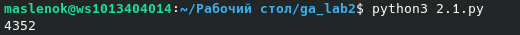
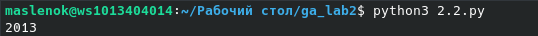
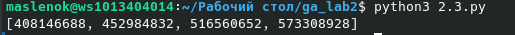

# лабораторная работа номер 2

## задание
Напишите программу для решения задач своего варианта.

# задачи и решения

1. Необходимо посчитать количество удовлетворяющих условий комбинаций букв, взяты из слова "вишня",
условие гласит: В используется не более одного раза. Каждая из других допустимых букв может встречаться в слове любое количество раз или не встречаться совсем. Слово не должно начинаться с буквы Ш и оканчиваться гласными буквами
воспользуемся оператором из библиотеки intertools, product и при помощи него переберём всевозможные комбинации с повторяющимися, независищами друг от друга символами, а затем в соответствии с условием исключим все неподходящие варианты.

2. Необходимо посчитать количество единиц в двоичной записи результата вычисления.
для решения получаем результат вычисления, и переводя его в двоичный вид считаем количество единиц

3. Требуется найти все натуральные числа NNN, принадлежащие отрезку [400 000 000; 600 000 000] которые можно представить в виде N  =  2m ⋅ 3n N  =  2^m · 3^n N  =  2m ⋅ 3n, где m — чётное число, n — нечётное число. При чём вывести ответ нужно в порядке возрастания. Для сортировки создаём список, затем при помощи циклов for задаём четные и нечетные значения для m и n после чего находим подходящие числа и выносим их в список. Сортируем список и выводим его в кчестве ответа

